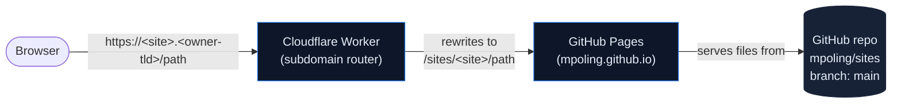
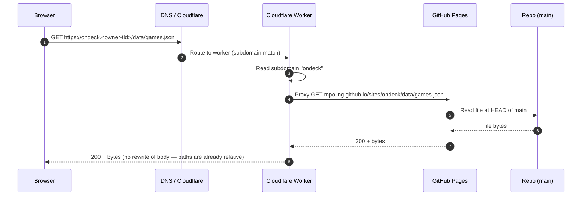
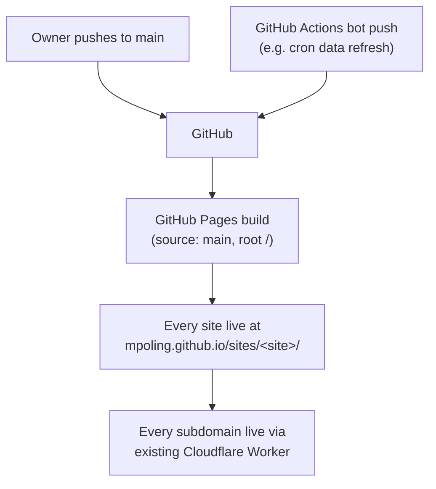
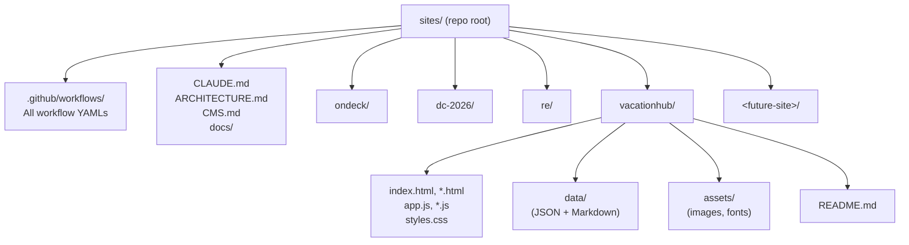
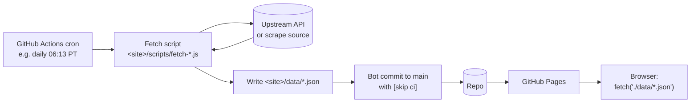
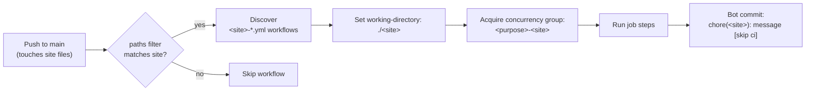

# Architecture

This document describes the architecture of the `mpoling/sites` monorepo: how
requests are routed, how deployments work, how sites are organized, and the
conventions that hold across them. For day-to-day contributor guidance, see
[`CLAUDE.md`](./CLAUDE.md). For the planned content-management layer, see
[`CMS.md`](./CMS.md).

---

## 1. System overview

`sites` is a **multi-site monorepo** for personal static websites. Each
top-level directory is an independent site, deployed as-is by GitHub Pages
and routed to a custom subdomain on the owner's TLD by a Cloudflare Worker.

The whole architecture in one diagram:



Key properties of this architecture:

- **No origin servers.** Static files only. No databases, no application
  runtimes, no per-site infrastructure.
- **One repository, many sites.** Each site is a top-level directory.
- **One deployment, many subdomains.** A push to `main` updates every site.
- **Custom subdomains are an edge concern.** The Cloudflare Worker is the
  only piece that maps `<site>.<owner-tld>` → `/sites/<site>/`. GitHub Pages
  knows nothing about subdomains.
- **The subdirectory must be invisible to the browser.** Because the worker
  rewrites the path, all in-page references must be relative; absolute paths
  starting with `/` would leak the `/sites/<site>/` prefix and break.

---

## 2. Request flow

A request from the browser to a rendered byte:



The worker's only job is the hostname-to-path rewrite. It does not modify
response bodies, set custom cache rules, or rewrite links. If the page asks
for `./styles.css` and the worker maps it to `sites/ondeck/styles.css`,
that file's `fetch('./data/games.json')` call resolves naturally to
`ondeck.<owner-tld>/data/games.json`, which the worker resolves to
`sites/ondeck/data/games.json`. The relative-paths-only rule is what makes
this work.

The worker is configured **outside this repo** in a separate Cloudflare
account. Nothing in this repo references it directly; its behavior shapes
several rules but the repo can be reasoned about as "files served at
`mpoling.github.io/sites/<site>/`" and the worker takes care of the rest.

---

## 3. Deployment



GitHub Pages serves the **entire repo root** from the `main` branch
(Settings → Pages → Source: `main` / `/`). Every site directory is
published at `https://mpoling.github.io/sites/<site>/`. The Cloudflare
Worker rewrites `<site>.<owner-tld>` → that path.

There is no per-site Pages config and no build step. Adding a new top-level
directory and pushing to `main` is the whole deploy.

**Practical consequences:**

- **A push to `main` ships every site at once.** There is no per-site
  staging. Changes should be scoped (see [`CLAUDE.md`](./CLAUDE.md)).
- **`.nojekyll` at the repo root** disables Jekyll processing so files or
  directories starting with `_` are served as-is. Do not remove it.
- **Bot commits also trigger Pages.** Workflows that commit back to `main`
  (data refreshes, image processing) result in a fresh deploy. Use
  `[skip ci]` in those commit messages to prevent the bot's push from
  re-triggering its own workflow, but be aware Pages itself still rebuilds.

There are no custom Cloudflare cache rules and no fallbacks. **If a site
stops resolving, suspect GitHub Pages first** (build status, source branch)
before the worker.

---

## 4. Repo layout



Each site directory is its own project root. A site contains its own
HTML/CSS/JS, its own assets, its own `data/`, its own `README.md`, and its
own helper scripts (under `<site>/scripts/`) if needed.

**There is no shared code or assets across sites.** No common stylesheet,
no shared JS library hosted in the repo, no asset CDN. If two sites
genuinely want the same thing, that becomes a future refactor
conversation — not a default.

---

## 5. Site conventions

These are technical rules every site must follow. (Aesthetic and editorial
conventions are per-site; see each site's `README.md`.)

### 5.1 Static only

No bundlers, no transpilers, no build steps. Sites deploy exactly as the
files appear in the repo. Vanilla HTML/CSS/JS only; fonts and libraries
pulled from CDNs at runtime (e.g., `marked` for client-side Markdown).

If a task seems to need a build pipeline, surface that question before
adding one — the constraint is intentional. (The one exception is the data
pipeline pattern in §6, where Python/Node scripts run in GitHub Actions to
*produce* static JSON files committed back to the repo. Those scripts are
infrastructure, not site code.)

### 5.2 Relative paths only

Because the Cloudflare Worker rewrites the subdomain to a subdirectory,
the subdirectory must be invisible to the browser. Every in-page reference
must be relative:

- ✅ `./styles.css`, `../data/games.json`, `assets/logo.svg`
- ❌ `/styles.css`, `/sites/<site>/styles.css`

This applies everywhere: `<link>`, `<script>`, ``, `<a href>`,
`fetch()`, `background-image: url(...)`, and any other URL.

### 5.3 Self-contained

A site's files live entirely within its directory. No cross-site imports,
no shared assets, no sibling references like `../<other-site>/foo.js`.

### 5.4 One README per site

Each site directory has a `README.md` covering purpose, layout, setup, and
operational quirks. This is the canonical place to learn what a specific
site is and how it's organized.

### 5.5 Modern evergreen browsers only

No IE, no legacy polyfills, no transpilation for older runtimes. Assume
ES2022, modern CSS, native `<dialog>`, etc.

---

## 6. Data pipeline pattern

Several sites need data that updates on a schedule: sports schedules,
itineraries, feeds. The pattern keeps sites truly static by moving the API
fetch out of the browser entirely and into a scheduled job that commits
clean JSON back to the repo.



What this gets:

- **No CORS issues.** The page fetches from its own origin.
- **No API keys in the client.** Secrets stay in GitHub Actions environment
  variables.
- **Instant page loads.** Data is local-relative bytes, not a remote API
  round-trip.
- **Trade**: refreshes are bound to the cron cadence. Default to daily;
  faster only when the data warrants it.

Sites that use this pattern today: `ondeck` (sports schedules). Sites that
may adopt it: `vacationhub` (operating-park hours, refurb status if those
data sources mature). Sites that don't need it: `dc-2026`, `re`.

---

## 7. GitHub Actions conventions

GitHub Actions only discovers workflow files placed *directly* in
`.github/workflows/`. Nesting (`.github/workflows/<site>/foo.yml`) is
invisible to the runner. The conventions below keep workflows logically
scoped to a single site despite this constraint.



### 7.1 Naming

Prefix every workflow file with its site name and a purpose:

```
.github/workflows/<site>-<purpose>.yml
```

Examples: `ondeck-update-games.yml`, `vacationhub-process-images.yml`.

### 7.2 Working directory

Declare the site as the default working directory so scripts can use
relative paths:

```yaml
defaults:
  run:
    working-directory: ./<site>
```

### 7.3 Trigger paths

Scope `push` triggers to the site's own files plus its own workflow:

```yaml
on:
  push:
    paths:
      - '<site>/**'
      - '.github/workflows/<site>-*.yml'
```

### 7.4 Concurrency

Site-scoped concurrency groups prevent per-site workflows from tripping
over each other:

```yaml
concurrency:
  group: <purpose>-<site>
```

### 7.5 Bot commits

Workflows that commit back to the repo use Conventional Commits with the
site scope and the `[skip ci]` token to prevent re-triggering:

```
chore(<site>): refresh games data [skip ci]
```

### 7.6 Permissions and identity

Workflows that push need write permission and a bot identity:

```yaml
permissions:
  contents: write
```

```bash
git config user.email "41898282+github-actions[bot]@users.noreply.github.com"
git config user.name "github-actions[bot]"
```

### 7.7 Cron times

Default to early-morning Pacific (the owner's timezone) and use off-round
minutes (e.g., `13 6 * * *`, not `0 6 * * *`) to be polite to upstream APIs
and to avoid the cron-tide herd of jobs that fire on the hour.

---

## 8. Existing sites

| Site         | Subdomain                 | Pattern                            | Data pipeline?       |
|--------------|---------------------------|------------------------------------|----------------------|
| `ondeck`     | `ondeck.<owner-tld>`      | Personal sports schedule           | Yes (daily cron)     |
| `dc-2026`    | `dc-2026.<owner-tld>`     | Static itinerary                   | No                   |
| `re`         | `re.<owner-tld>`          | Brand direction explorations       | No                   |
| `vacationhub`| `vacationhub.<owner-tld>` | Theme-park content hub             | Not yet              |

`dc-2026` and `re` predate the conventions codified here and may not
follow every rule — match each one's existing patterns when editing it.

---

## 9. What's intentionally not here

These are decisions the architecture has *taken*, not gaps:

- **No CI for site code beyond data jobs.** No tests, no linters, no
  formatters wired into CI. The personal-scale ethos prefers
  manual-eyes-on-PR-style review (in-session with Claude) over enforced
  automation.
- **No staging environment.** `main` is production. Mistakes are reverted
  via git, not gated.
- **No CDN beyond Cloudflare.** GitHub Pages + Cloudflare is enough; no
  separate asset CDN, no image processing service.
- **No package manager for the sites themselves.** Sites import libraries
  from CDNs at runtime (`<script src="https://cdn.jsdelivr.net/...">`).
  `package.json` files only appear in `<site>/scripts/` directories that
  back data-pipeline jobs.

---

## 10. Where things are heading

A few directional notes about how this architecture is expected to evolve:

- **Content management (CMS) for non-technical authors.** Documented
  separately in [`CMS.md`](./CMS.md). The choice is **Sveltia CMS**,
  added per-site as `<site>/admin/` with browser-side editing committing
  directly to `main`. No changes to the deployment or routing
  architecture.
- **More data-pipeline sites.** Anything calendar-shaped, schedule-shaped,
  or feed-shaped is a candidate for the §6 pattern.
- **Possible future shared infrastructure**: image processing GitHub
  Action (a reusable composite action under `.github/actions/` that any
  site's workflows can call) if the same image-processing logic ends up
  needed in multiple sites. Not built yet; mentioned as a likely
  consolidation point.

No expected changes to the worker, the GitHub Pages source, the
relative-paths-only rule, or the self-contained-sites rule.
