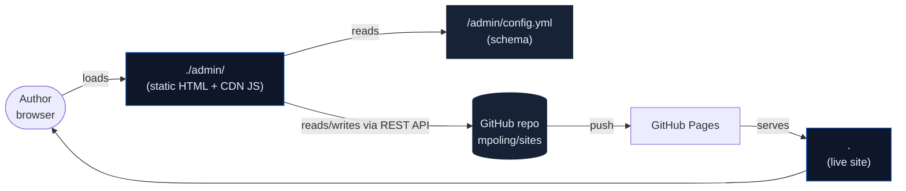
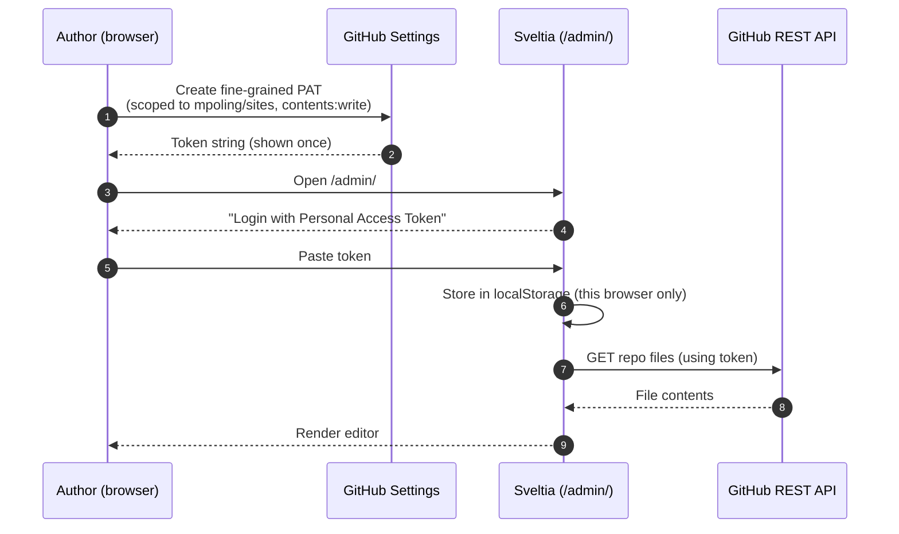
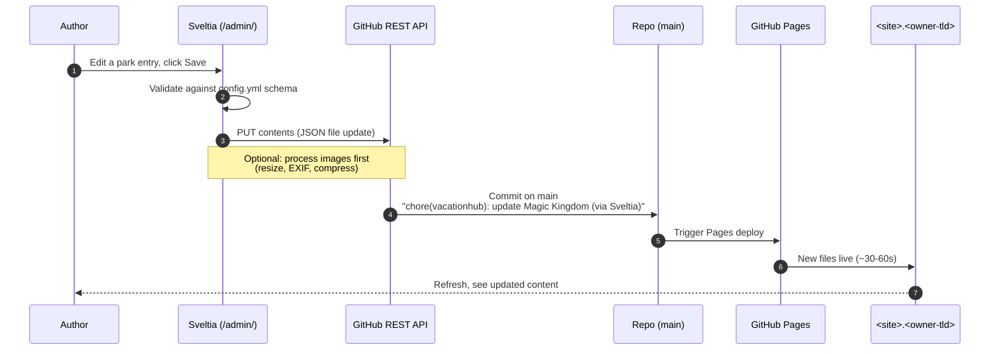
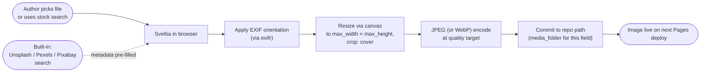
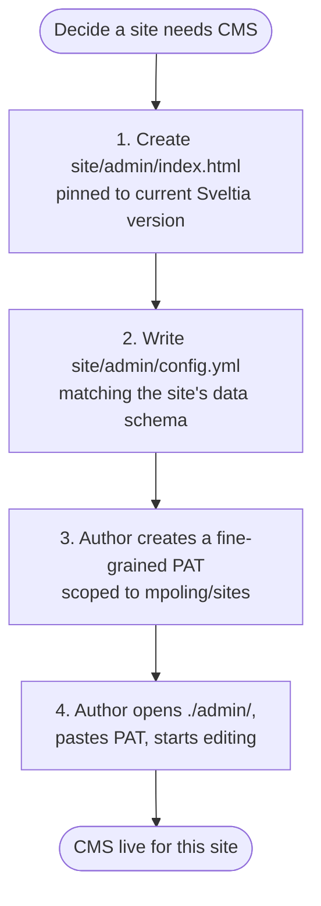

# CMS

This document describes the content-management architecture for sites in
this repo. For the underlying static-site architecture, see
[`ARCHITECTURE.md`](./ARCHITECTURE.md). For day-to-day contributor
guidance, see [`CLAUDE.md`](./CLAUDE.md).

**Status:** **Sveltia CMS** is the chosen tool. As of this writing it is
documented but not yet adopted; this file describes the design and is the
specification for the integration work.

---

## 1. Why a CMS at all

Several sites in this repo (currently `vacationhub`, likely more later)
are *content* sites that grow over time as new entries are added: parks,
itineraries, brand explorations. Authoring directly in JSON and Markdown
works fine for the developer-owner but is a wall for non-technical
authors. A CMS turns those files into form-based editing that the author
can do from a browser without learning the underlying schema.

The non-goal is "general-purpose CMS for everything." Most sites in the
repo (`re`, `dc-2026`) will never use the CMS. It's opt-in per site.

---

## 2. Tool choice: Sveltia CMS

[Sveltia CMS](https://github.com/sveltia/sveltia-cms) is a Svelte rewrite
of [Decap CMS](https://decapcms.org/) (formerly Netlify CMS). It maintains
high config-compatibility with Decap but fixes three of Decap's biggest
frictions for our scenario:

1. **Personal Access Token (PAT) auth** — no OAuth proxy needed for a
   single-author site.
2. **Browser-side image processing** — resize, EXIF auto-rotate, WebP
   conversion built in. Removes a category of GitHub Action complexity
   that Decap requires.
3. **Stock photo integrations** — Unsplash, Pexels, Pixabay search and
   attribution inside the editor.

Tradeoffs accepted:

- **Solo-maintained** (by `@kyoshino`). PRs from outside contributors are
  currently disabled. Active commit cadence (2–5 day release cycle as of
  mid-2026) but real bus-factor risk. Mitigation: pin the CDN URL to a
  specific version.
- **No editorial workflow (PR mode).** Save commits directly to the
  configured branch. For a one-author site with weekly review by the
  owner, this is acceptable; for higher-stakes content it would not be.
- **No custom widget API yet** (targeted for v1.0 RC). Acceptable because
  our schema fits the built-in widgets.

Alternatives evaluated:

- **Decap CMS** — more diversified maintenance but requires an OAuth
  proxy (Cloudflare Worker) and a GitHub Action for image processing.
  Editorial workflow (PR mode) is its one advantage.
- **Pages CMS** — cleanest auth model (GitHub App) and zero CMS files
  inside the site directory (config lives at repo root). Loses to Sveltia
  on image workflow (no browser-side resize, no stock photo search) and
  introduces a hosted-service dependency on `app.pagescms.org`.

The full comparison reasoning lives in the session transcript that led to
this decision and is not reproduced here; this doc captures the result.

---

## 3. Architecture overview



**The mental model:** Sveltia is a **thick browser client** that lives at
`/admin/` on the site itself. There is no Sveltia server. The author's
browser talks directly to the GitHub REST API to read and write content
files. When the author hits Save, a commit lands in `mpoling/sites` and
GitHub Pages re-deploys within ~1 minute.

This means the CMS adds **no new infrastructure** to the system described
in [`ARCHITECTURE.md`](./ARCHITECTURE.md). No new server. No new worker.
No new database. Just three files per CMS-enabled site:
`admin/index.html`, `admin/config.yml`, and `data/.cms-version`
(optional, for pinning).

---

## 4. Authentication

Sveltia supports PAT mode for single-author sites. The full auth setup is
**one-time, browser-only**.



### 4.1 Token scoping

The PAT is **fine-grained**, scoped to `mpoling/sites` specifically, with
the minimal permissions needed:

- **Contents: Read and write** — to read existing content files and
  commit new ones
- **Metadata: Read** — required by GitHub for any fine-grained PAT

That's it. The token cannot touch other repos, cannot access other parts
of the owner's account, cannot read or write GitHub Actions secrets,
cannot manage releases.

### 4.2 Token lifecycle

- **Created at:** github.com/settings/personal-access-tokens
- **Stored in:** the author's browser localStorage on the device they
  use to edit (e.g., a family laptop). The token never leaves that
  browser.
- **Revoked at:** github.com/settings/personal-access-tokens (one click).
- **Expires:** configurable at creation; recommend setting a moderate
  expiry (e.g., 1 year) so a forgotten token doesn't live forever.

### 4.3 Multi-author handling

If multiple authors ever need to edit, each creates their own PAT and
pastes it into their own browser. Commits are attributed to whoever owns
the PAT. There is no shared account.

### 4.4 Why not OAuth or GitHub App

OAuth requires a server to exchange the auth code for a token using a
`client_secret` that can't live in a browser. That means hosting an OAuth
proxy (Cloudflare Worker, Netlify Function, etc.) and registering a
GitHub OAuth App. That's the right answer for multi-user public CMSes; it
is over-engineered for a single-author personal site.

GitHub Apps would be cleaner architecturally but Sveltia doesn't support
them as a backend type today (Decap and Pages CMS do, in different ways).

PAT is the simplest auth that works for one author.

---

## 5. Files added per CMS-enabled site

Adding the CMS to a site adds exactly two files within that site
directory, plus an optional pin file:

```
<site>/
└── admin/
    ├── index.html         # ~10 lines, loads Sveltia from CDN
    ├── config.yml         # the schema for this site's content
    └── (no other files)
```

### 5.1 `admin/index.html`

A static HTML shell that loads the Sveltia bundle from a CDN. Pinned to a
specific version (never `@latest`) to avoid surprise breakage.

```html
<!DOCTYPE html>
<html lang="en">
<head>
  <meta charset="UTF-8">
  <meta name="viewport" content="width=device-width, initial-scale=1.0">
  <title>VacationHub · Admin</title>
</head>
<body>
  <script type="module"
          src="https://unpkg.com/@sveltia/cms@0.161.1/dist/sveltia-cms.js"></script>
</body>
</html>
```

### 5.2 `admin/config.yml`

The schema for this site's content. Tells Sveltia what collections exist,
what fields each entry has, where files live, what widgets to use. YAML,
not JSON. (See §7 for an extended example.)

### 5.3 Why not a single repo-root config

Each CMS-enabled site gets its own `/admin/` route at its own subdomain.
Putting the config inside the site directory keeps everything related to
that site under one path, matching the [self-contained-sites
convention](./ARCHITECTURE.md#53-self-contained). If two sites later need
CMS access, they each get their own `admin/` directory and config.

---

## 6. Edit-to-publish flow

What happens when the author saves a change:



**Key properties:**

- **No staging.** Save goes live within a minute.
- **Atomic commits.** One save = one commit. Image uploads attached to the
  same edit are part of that commit. The author never sees an
  in-between state.
- **Standard git history.** Every commit is attributed (via the PAT) to
  the author's GitHub identity. `git log` shows their name.
- **Rollback is git revert.** If the author publishes something they
  didn't intend, the owner can revert the commit from the GitHub UI in
  three clicks.

There is no draft mode. If draft-like behavior is needed (e.g., author
prepares content for a future trip and doesn't want it live yet), the
schema includes a `published: bool` field on the entry, and the
renderer hides unpublished entries.

---

## 7. Schema and image-with-credit pattern

The schema for VacationHub's parks collection — illustrative; each
CMS-enabled site has its own. Notice in particular how the
**image-with-credit** object pattern (introduced in
[VacationHub design spec §5.6](./docs/superpowers/specs/2026-05-17-vacationhub-design.md))
maps to Sveltia's `object` widget with nested fields.

### 7.1 Schema fragment

```yaml
backend:
  name: github
  repo: mpoling/sites
  branch: main
  auth_type: pat      # personal access token mode

media_folder: vacationhub/assets/images/uploads
public_folder: ./assets/images/uploads

collections:
  - name: parks
    label: Parks
    folder: vacationhub/data/parks
    create: true
    slug: '{{slug}}'
    format: json
    fields:
      - { name: slug, label: Slug, widget: string }
      - { name: name, label: Park name, widget: string }
      - name: brand
        label: Brand
        widget: select
        options: [disney, universal, legoland, cedar-fair, six-flags, dollywood]
      # ... omitted for brevity: resort, location, opened, etc.

      # The image-with-credit pattern, expressed in Sveltia's widget syntax
      - name: hero
        label: Hero image
        widget: object
        fields:
          - name: src
            label: Image
            widget: image
            media_folder: /vacationhub/assets/images/parks
            public_folder: ./assets/images/parks
            # Sveltia-specific: target dimensions for browser-side resize
            max_width: 2400
            max_height: 1000
            crop: cover
          - name: credit
            label: Credit
            widget: object
            fields:
              - { name: author, label: Author, widget: string }
              - { name: license, label: License, widget: string,
                  hint: "e.g., CC BY-SA 4.0" }
              - { name: source, label: Source URL, widget: string }

      # Rides as a repeatable list of objects with per-item image
      - name: rides
        label: Rides
        widget: list
        fields:
          - { name: slug, label: Slug, widget: string }
          - { name: name, label: Name, widget: string }
          # ... (intensity, height_min_in, etc. omitted)
          - name: photo
            label: Photo
            widget: object
            required: false
            fields:
              - name: src
                label: Image
                widget: image
                media_folder: /vacationhub/assets/images/rides/{{fields.slug}}
                public_folder: ./assets/images/rides/{{fields.slug}}
                max_width: 800
                max_height: 450
                crop: cover
              - name: credit
                label: Credit
                widget: object
                fields:
                  - { name: author, label: Author, widget: string }
                  - { name: license, label: License, widget: string }
                  - { name: source, label: Source URL, widget: string }
```

### 7.2 Mapping common widget needs

| Schema need | Sveltia widget |
|-------------|----------------|
| Single-line text | `widget: string` |
| Long prose with markdown | `widget: markdown` |
| Number with min/max | `widget: number` with `min`/`max` |
| Dropdown | `widget: select` with `options` |
| Image upload with dimension targeting | `widget: image` with `max_width`/`max_height`/`crop` |
| Nested object (e.g., `{ src, credit }`) | `widget: object` with sub-`fields` |
| Repeatable list of items | `widget: list` with sub-`fields` |
| Reference to another collection's entries | `widget: relation` |
| Boolean toggle | `widget: boolean` |
| Date | `widget: datetime` |

### 7.3 Cross-file relations

A "Tips" collection that needs to point at a park gets a `relation`
widget that populates a dropdown from the parks folder:

```yaml
- name: park
  label: Park
  widget: relation
  collection: parks
  search_fields: [name, slug]
  value_field: slug
  display_fields: [name]
```

Result: instead of typing `magic-kingdom` into a text field (and
risking typos), the author picks from a dropdown that lists every park
in the repo.

---

## 8. Image handling

Sveltia handles image processing **browser-side** before commit. This is
the most significant architectural simplification vs. alternative CMSes.



### 8.1 What Sveltia does for us

- **EXIF auto-rotation.** No more sideways iPhone photos.
- **Resize to target dimensions.** Configured per field via `max_width`,
  `max_height`, `crop: cover`. The author's source image can be 4000px
  wide; what gets committed is the right size for the use.
- **Cover-cropping.** Same semantics as the Python script we wrote
  manually: resize so the smaller dimension fits, then center-crop the
  excess.
- **JPEG / WebP encoding.** Configurable compression. Default to JPEG for
  compatibility with current site code; revisit WebP later.
- **Stock photo search inline.** Unsplash, Pexels, and Pixabay all
  searchable from the image field. Selection auto-populates author,
  license, and source URL into adjacent credit fields where the schema
  expects them.

### 8.2 What Sveltia does NOT do

- **Wikimedia Commons search.** Not built in. For Wikimedia-licensed
  imagery (often the only source for niche subjects like specific theme
  park rides), the author manually finds the file, downloads it, and
  uploads via the standard image widget — pasting author/license/source
  into the credit fields manually.
- **Bulk reprocessing.** Existing committed images stay as they are.
  Adopting Sveltia doesn't re-process the 11 manually-prepared
  VacationHub images.
- **CDN offloading.** Images stay in the repo at the configured paths.
  No external image host or transformation service.

### 8.3 Implications for the data pipeline pattern

The [data pipeline pattern](./ARCHITECTURE.md#6-data-pipeline-pattern)
described in `ARCHITECTURE.md` is orthogonal to the CMS. A site can have
both: scheduled jobs writing to `data/` *and* humans editing via the CMS.
They commit to different files (or different fields), so they don't
conflict. The CMS author should not edit files that the cron pipeline
owns; the schema simply omits those files from the editable collections.

---

## 9. Per-site adoption

Adopting Sveltia for a new site is a four-step recipe:



**Not required:**

- No new GitHub repo
- No new server
- No new Cloudflare configuration
- No DNS changes
- No new secrets in GitHub Actions
- No build step added anywhere

**One-time per author** (not per site):

- A fine-grained PAT in the author's GitHub account scoped to
  `mpoling/sites`. The same PAT works for every CMS-enabled site.

---

## 10. Constraints and conventions for CMS-enabled sites

### 10.1 The renderer must accept the schema as-authored

If the CMS writes a JSON file in a particular shape, the site's
client-side JS has to render exactly that shape. Schema and renderer move
together. When adding a new field via the CMS config, update the
renderer in the same commit (or it lands empty in the editor and the
author can't tell why).

### 10.2 Image fields must declare target dimensions

Every `widget: image` field declares `max_width`, `max_height`, and
`crop: cover`. Don't rely on Sveltia's defaults — they vary and won't
match the site's design system.

### 10.3 Credit object on every image

Every image field is wrapped in an `object` widget that includes a
nested `credit` object with `author`, `license`, `source`. The renderer
displays the credit as an overlay. This rule is upstream from any specific
site (VacationHub's spec §5.6 defines it; future CMS-enabled sites should
adopt it too).

### 10.4 Pin Sveltia versions

`admin/index.html` references a specific Sveltia version, not `@latest`.
When upgrading, do it deliberately as a single commit so a regression can
be reverted cleanly.

### 10.5 Hide what the CMS shouldn't edit

`config.yml` should explicitly omit collections or fields the author
shouldn't touch — homepage rail curation, internal metadata, anything
owned by a cron pipeline. If it's not in the config, the CMS can't show
it or edit it.

### 10.6 Don't add `/admin/` to a site without considering crawler exposure

`/admin/` is publicly accessible. Anyone can visit
`<site>.<owner-tld>/admin/` and see the login screen. That's by design —
PAT-gated — but it's a known surface. For sites that index well in search,
add `Disallow: /admin/` to a `robots.txt` for that site.

---

## 11. Failure modes and recovery

| Failure | Cause | Recovery |
|---------|-------|----------|
| Author can't log in | PAT expired, revoked, or scoped wrong | Author regenerates PAT, re-pastes |
| Save fails silently | Schema mismatch (known Sveltia bug class) | Owner inspects `config.yml`, fixes, redeploys |
| Image upload hangs | CDN bundle issue or browser file-API quirk | Refresh; if persistent, fall back to direct git commit |
| Sveltia CDN goes down | unpkg/jsdelivr outage | Author waits; owner can mirror the bundle to repo as a backup |
| Sveltia maintainer abandons project | Version pinning protects existing config; new bugs accumulate | Migrate to Decap (config-compatible) or Pages CMS (less work than rebuilding from scratch) |
| Author commits something embarrassing | No editorial workflow gate | Owner runs `git revert <sha>`, force-publishes |
| Two authors edit the same entry simultaneously | Git merge conflict on commit | Sveltia surfaces the conflict; last-write-wins after refresh |

The single-most-likely failure is **a bug in Sveltia itself** — it's
solo-maintained and not heavily tested in the wild. Mitigations:

1. Pin the version.
2. Keep the underlying JSON/MD schema authorable by hand (i.e., don't
   adopt Sveltia-only features that lock the data in). The CMS is a
   convenience, not a dependency. The renderer reads files the owner
   could just as easily edit in a text editor.
3. Treat the CMS as Path A (recommended) but keep Path B (direct file
   editing) viable as a permanent fallback.

---

## 12. What this doc doesn't cover

- **Specific renderer changes** to accommodate Sveltia-authored content.
  Those live in each site's design spec and implementation plans. For
  VacationHub specifically: the image-with-credit schema (§5.6 of the
  design spec) already matches what Sveltia will write, so no renderer
  changes are required for the initial adoption.
- **The work of actually installing Sveltia on VacationHub.** That's an
  implementation plan, not architecture. See
  `docs/superpowers/plans/` once written.
- **A general comparison** of Sveltia vs. Decap vs. Pages CMS. The
  comparison happened in the conversation that led to choosing Sveltia
  and is not reproduced here. This doc captures the decision.
