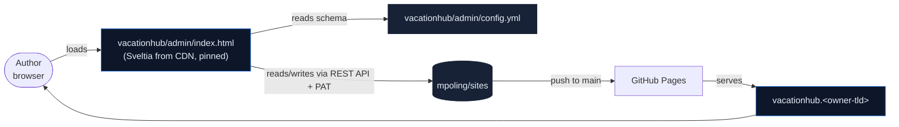

# VacationHub — Sveltia CMS Adoption Spec

**Status:** Draft for v1 (initial Sveltia rollout on VacationHub)
**Date:** 2026-05-17
**Site:** `vacationhub/`
**Related docs:**
- [`/CMS.md`](../../../CMS.md) — repo-level CMS architecture (chosen tool, auth model, conventions)
- [`/ARCHITECTURE.md`](../../../ARCHITECTURE.md) — repo-level static site architecture
- [`2026-05-17-vacationhub-design.md`](./2026-05-17-vacationhub-design.md) — the VacationHub design spec that this CMS adoption layers onto

## 1. Purpose

Add a content-authoring layer to VacationHub so a non-technical author
(the owner's 13-year-old son) can add and edit content from a browser
without learning JSON, Markdown, or git. Editing happens at
`vacationhub.<owner-tld>/admin/`; saves commit to `main` and go live in
about a minute.

The repo-level decision to use **Sveltia CMS** for this and any future
CMS-enabled site is documented in [`/CMS.md`](../../../CMS.md). This spec
captures the **VacationHub-specific** adoption: which collections are
exposed, schema mapping, renderer changes, migration of existing
content, and documentation for the author.

## 2. Scope

### 2.1 In scope (v1)

- New `vacationhub/admin/` directory (Sveltia loader HTML + config YAML)
- Two editable collections: **Parks** and **Ride Collections**
- One-time migration: inline existing tip `.md` bodies into the park JSON
- Renderer changes:
  - `app.js` — `creditEl` accepts credit as either structured object or
    HTML string (the latter is what Sveltia's stock photo integration
    produces)
  - `tip.js` — read tip body from the loaded park JSON instead of
    fetching a separate `.md` file
- New `vacationhub/robots.txt` with `Disallow: /admin/`
- New README section documenting how the author logs in and edits

### 2.2 Out of scope (deferred)

- Stock photo API key setup walkthrough (Unsplash etc.) — the author
  can register a key later if he wants stock search; not required for v1
- Wikimedia helper / any custom widget
- Drafts / `published: bool` toggle
- Editing the homepage rails (`data/index.json` stays out of the CMS)
- Bulk reprocessing of existing committed images
- Multi-author setup
- Sveltia adoption for other sites in the repo (one-site rollout first)
- GitHub Actions for image processing (Sveltia handles browser-side, no
  Action needed)

## 3. Architecture



Nothing about the existing routing or deployment changes. The CMS adds
no server, no worker, no GitHub Action. It is purely client-side JS
loaded from a CDN, configured by a single YAML file, talking to the
GitHub REST API on the author's behalf.

## 4. Files added, modified, deleted

### 4.1 Added (3)

- `vacationhub/admin/index.html` — Sveltia loader. Pinned to
  `@0.161.1`.
- `vacationhub/admin/config.yml` — schema for Parks + Ride Collections.
  Full content in §6.
- `vacationhub/robots.txt` — content:
  ```
  User-agent: *
  Disallow: /admin/
  ```

### 4.2 Modified (4)

- `vacationhub/data/parks/magic-kingdom.json` — each entry in `tips[]`
  gains a `body` field containing the inlined Markdown content. See §7.
- `vacationhub/app.js` — `VH.creditEl` updated to accept either the
  existing structured `{ author, license, source }` credit object OR an
  HTML string (Sveltia stock-photo format). See §5.1.
- `vacationhub/tip.js` — reads `body` from the already-loaded park JSON
  instead of fetching `<park>/tips/<slug>.md`. See §5.2.
- `vacationhub/README.md` — new "Editing content with the CMS" section
  for the author. See §8.

### 4.3 Deleted (3)

After migration:

- `vacationhub/data/parks/magic-kingdom/tips/rope-drop.md`
- `vacationhub/data/parks/magic-kingdom/tips/lightning-lane.md`
- `vacationhub/data/parks/magic-kingdom/tips/best-time-to-visit.md`

(The empty `tips/` directory disappears as well.)

## 5. Renderer changes

### 5.1 `app.js` — `creditEl` accepts string or object

The site already accepts two image shapes via `VH.imgSrc(img)`:
either a bare path string or `{ src, credit: { ... } }`. Sveltia's
stock photo integrations (Unsplash, Pexels) auto-populate credit as
an HTML string of the form `Photo by <a>Name</a> on <a>Unsplash</a>`,
not as our structured object. Rather than force a manual re-entry every
time stock search is used, the renderer accepts both.

Before:

```js
VH.creditEl = (img, opts) => {
  const c = VH.imgCredit(img);
  if (!c) return null;
  const text = `© ${c.author}${c.license ? ' · ' + c.license : ''}`;
  const cls = 'img-credit' + (opts && opts.subtle ? ' img-credit-subtle' : '');
  if (c.source) {
    return VH.el('a', { class: cls, href: c.source, target: '_blank', rel: 'noopener noreferrer' }, [text]);
  }
  return VH.el('span', { class: cls }, [text]);
};
```

After:

```js
VH.creditEl = (img, opts) => {
  const c = VH.imgCredit(img);
  if (!c) return null;
  const cls = 'img-credit' + (opts && opts.subtle ? ' img-credit-subtle' : '');

  // Stock-photo credit (HTML string from Sveltia's Unsplash/Pexels integration)
  if (typeof c === 'string') {
    return VH.el('span', { class: cls, html: c });
  }

  // Structured credit object (manual entry / Wikimedia)
  const text = `© ${c.author}${c.license ? ' · ' + c.license : ''}`;
  if (c.source) {
    return VH.el('a', { class: cls, href: c.source, target: '_blank', rel: 'noopener noreferrer' }, [text]);
  }
  return VH.el('span', { class: cls }, [text]);
};
```

`VH.imgCredit(img)` is updated to return whatever is in `img.credit`
(string OR object) instead of coercing.

The HTML credit string uses Sveltia's link markup, which is rendered
via `html:` rather than `text:`. The trust boundary is acceptable
because the HTML comes from a known set of stock-photo integrations
whose output shape we control via Sveltia's config.

### 5.2 `tip.js` — read body from inline JSON

Before, `tip.js` does:

```js
const [park, md] = await Promise.all([
  fetchJSON(`./data/parks/${parkSlug}.json`),
  fetchText(`./data/parks/${parkSlug}/tips/${tipSlug}.md`),
]);
// ... later:
body.innerHTML = window.marked.parse(md);
```

After:

```js
const park = await fetchJSON(`./data/parks/${parkSlug}.json`);
const tipMeta = (park.tips || []).find((t) => t.slug === tipSlug);
if (!tipMeta) { renderError($('#main'), `Tip "${tipSlug}" not listed in park manifest.`); return; }
// ... later:
body.innerHTML = window.marked.parse(tipMeta.body || '');
```

Net effect: one fewer HTTP fetch on every tip page load. `VH.fetchText`
stays in `app.js` for future use; only this caller is removed.

If `tipMeta.body` is missing (an edge case if someone adds a tip
manifest entry without writing the body), the page renders the header
and an empty article body rather than crashing. The site still works;
the tip just looks empty.

## 6. `admin/config.yml`

Full content. Notable design choices noted inline as YAML comments.

```yaml
backend:
  name: github
  repo: mpoling/sites
  branch: main
  auth_type: pat

# Site URL is used for the "View on site" link in the editor
site_url: https://vacationhub.<owner-tld>

# Default landing path for any image uploaded without a per-field media_folder
media_folder: vacationhub/assets/images/uploads
public_folder: ./assets/images/uploads

# Normalize uploaded filenames (lowercase, dashes) so the repo stays tidy
media_library:
  config:
    slugify_filename: true

collections:
  # ============================== PARKS ==============================
  - name: parks
    label: Parks
    label_singular: Park
    folder: vacationhub/data/parks
    create: true
    delete: true
    slug: '{{slug}}'
    format: json
    identifier_field: slug
    summary: '{{name}} ({{brand}})'
    fields:
      # --- Identity ---
      - { name: slug, label: Slug, widget: string,
          hint: "URL slug — lowercase, hyphens only (e.g. magic-kingdom)" }
      - { name: name, label: Park name, widget: string }
      - name: brand
        label: Brand
        widget: select
        options: [disney, universal, legoland, cedar-fair, six-flags, dollywood]
      - { name: resort, label: Resort name, widget: string, required: false }

      # --- Location ---
      - name: location
        label: Location
        widget: object
        fields:
          - { name: city, label: City, widget: string }
          - { name: state, label: State / Province, widget: string }
          - { name: country, label: Country, widget: string, default: US }
          - { name: lat, label: Latitude, widget: number, required: false, value_type: float }
          - { name: lng, label: Longitude, widget: number, required: false, value_type: float }

      # --- Basics ---
      - { name: opened, label: Year opened, widget: number, required: false, value_type: int }
      - { name: size_acres, label: Size (acres), widget: number, required: false, value_type: int }
      - { name: official_url, label: Official site URL, widget: string, required: false }
      - { name: summary, label: Editorial summary, widget: text }

      # --- Hero image ---
      - name: hero
        label: Hero image (2400×1000)
        widget: object
        fields:
          - name: src
            label: Image
            widget: image
            media_folder: /vacationhub/assets/images/parks
            public_folder: ./assets/images/parks
            choose_url: false
          - name: credit
            label: Credit
            widget: object
            fields:
              - { name: author, label: Photographer, widget: string }
              - { name: license, label: License, widget: string,
                  hint: "e.g. CC BY-SA 4.0, CC0, Self" }
              - { name: source, label: Source URL, widget: string, required: false }

      # --- Rides ---
      - name: rides
        label: Rides
        widget: list
        label_singular: Ride
        summary: '{{fields.name}} ({{fields.land}})'
        fields:
          - { name: slug, label: Slug, widget: string }
          - { name: name, label: Name, widget: string }
          - { name: land, label: Land, widget: string }
          - name: type
            label: Type
            widget: select
            options: [roller-coaster, dark-ride, water, show, flat, boat, transport, other]
          - { name: subtype, label: Subtype, widget: string, required: false,
              hint: "Free-form — e.g. indoor-dark, mine-train, launched" }
          - { name: manufacturer, label: Manufacturer, widget: string, required: false }
          - { name: opened, label: Year opened, widget: number, required: false, value_type: int }
          - { name: duration_sec, label: Duration (sec), widget: number, required: false, value_type: int }
          - { name: length_ft, label: Length (ft), widget: number, required: false, value_type: int }
          - { name: top_speed_mph, label: Top speed (mph), widget: number, required: false, value_type: int }
          - { name: height_min_in, label: Min height (in), widget: number, required: false, value_type: int }
          - { name: single_rider, label: Single rider lane, widget: boolean, default: false }
          - name: priority_access
            label: Priority access tier
            widget: select
            options: [none, multipass, premier, express-unlimited]
            default: none
          - name: accessibility
            label: Accessibility
            widget: object
            fields:
              - { name: wheelchair_transfer, label: Wheelchair transfer, widget: boolean, default: false }
              - { name: must_transfer, label: Must transfer, widget: boolean, default: false }
              - { name: service_animal_ok, label: Service animals OK, widget: boolean, default: false }
          - name: intensity
            label: Intensity (1–5)
            widget: number
            value_type: int
            min: 1
            max: 5
          - { name: blurb, label: One-line take, widget: string }
          - name: collections
            label: Member of collections
            widget: relation
            collection: collections
            multiple: true
            search_fields: [name]
            value_field: slug
            display_fields: [name]
            required: false
          - name: photo
            label: Photo (800×450)
            widget: object
            required: false
            fields:
              - name: src
                label: Image
                widget: image
                media_folder: /vacationhub/assets/images/rides/{{fields.slug}}
                public_folder: ./assets/images/rides/{{fields.slug}}
              - name: credit
                label: Credit
                widget: object
                fields:
                  - { name: author, label: Photographer, widget: string, required: false }
                  - { name: license, label: License, widget: string, required: false }
                  - { name: source, label: Source URL, widget: string, required: false }

      # --- Tips (with inlined body) ---
      - name: tips
        label: Tips
        widget: list
        label_singular: Tip
        summary: '{{fields.title}}'
        fields:
          - { name: slug, label: Slug, widget: string,
              hint: "URL slug — e.g. rope-drop" }
          - { name: title, label: Title, widget: string }
          - { name: summary, label: Summary (one sentence), widget: string }
          - { name: updated, label: Last updated, widget: datetime,
              format: 'YYYY-MM-DD', date_format: 'YYYY-MM-DD', time_format: false }
          - name: body
            label: Body
            widget: markdown
            modes: [raw]
            hint: "Markdown. Headings use ## and ###. Lists with -. Bold with **text**."

  # ============================== COLLECTIONS ==============================
  - name: collections
    label: Ride collections
    label_singular: Collection
    folder: vacationhub/data/collections
    create: true
    delete: true
    slug: '{{slug}}'
    format: json
    identifier_field: slug
    summary: '{{name}}'
    fields:
      - { name: slug, label: Slug, widget: string }
      - { name: name, label: Name, widget: string }
      - name: scope
        label: Scope
        widget: object
        hint: "Fill EITHER park OR brand, never both."
        fields:
          - name: park
            label: Park (if park-scoped)
            widget: relation
            collection: parks
            search_fields: [name]
            value_field: slug
            display_fields: [name]
            required: false
          - { name: brand, label: Brand (if brand-scoped), widget: string, required: false,
              hint: "e.g. disney, universal" }
      - { name: intro, label: Intro blurb, widget: text }
      - name: tile
        label: Tile image (800×450)
        widget: object
        required: false
        fields:
          - name: src
            label: Image
            widget: image
            media_folder: /vacationhub/assets/images/collections
            public_folder: ./assets/images/collections
          - name: credit
            label: Credit
            widget: object
            fields:
              - { name: author, label: Photographer, widget: string, required: false }
              - { name: license, label: License, widget: string, required: false }
              - { name: source, label: Source URL, widget: string, required: false }
      - name: rides
        label: Rides in this collection
        widget: list
        summary: '{{fields.ride}}'
        fields:
          - name: park
            label: Park (only for cross-park / brand-scoped collections)
            widget: relation
            collection: parks
            value_field: slug
            display_fields: [name]
            required: false
            hint: "Leave blank when the collection's scope is a single park."
          - { name: ride, label: Ride slug, widget: string }
          - { name: blurb, label: Curator blurb, widget: string }
```

### 6.1 Design notes on the config

- **`auth_type: pat`** — uses Personal Access Token mode, per the
  CMS.md decision. No OAuth proxy needed.
- **`delete: true`** — author can delete entries through the editor.
  Acceptable because git history makes deletes recoverable.
- **`relation` widgets** — ride `collections`, collection ride
  references, and collection `scope.park` all use dropdowns populated
  from other collections. Removes a category of typo bug.
- **Per-field `media_folder`** — each image field routes uploads to
  the correct repo path. Different image types live in different
  folders without any rename step.
- **`{{fields.slug}}` interpolation** — ride photos land under
  `/rides/<ride-slug>/`. If a ride is renamed after upload, the photo
  stays at the old path until manually moved. Acceptable; the schema
  references the path stored at upload time, so the renderer doesn't
  break.
- **The `tile` field on collections is `required: false`** to match
  existing data — but practically, every collection should have one.

## 7. Migration: inline tip `.md` bodies

Three files convert to `body` fields in
`vacationhub/data/parks/magic-kingdom.json`:

| Source file | Becomes |
|---|---|
| `data/parks/magic-kingdom/tips/rope-drop.md` | `tips[0].body` |
| `data/parks/magic-kingdom/tips/lightning-lane.md` | `tips[1].body` |
| `data/parks/magic-kingdom/tips/best-time-to-visit.md` | `tips[2].body` |

The migration:

1. Read each `.md` file as text
2. Set it as the `body` string of the matching `tips[]` entry (matched
   by slug)
3. Validate the JSON parses
4. Delete the `.md` files
5. Remove the now-empty `data/parks/magic-kingdom/tips/` directory

Done in a single commit so the renderer change (which expects `body`
inline) and the schema change land atomically.

Newline handling: JSON requires `\n` escape sequences in strings.
Whatever does the migration (manual edit, small script, or a Python
one-liner) must JSON-encode the Markdown body properly. A reference
one-liner that does it correctly:

```bash
python3 -c "
import json
with open('vacationhub/data/parks/magic-kingdom.json') as f: park = json.load(f)
for tip in park['tips']:
    with open(f'vacationhub/data/parks/magic-kingdom/tips/{tip[\"slug\"]}.md') as g:
        tip['body'] = g.read()
with open('vacationhub/data/parks/magic-kingdom.json', 'w') as f:
    json.dump(park, f, indent=2, ensure_ascii=False)
    f.write('\n')
"
```

After: `rm -rf vacationhub/data/parks/magic-kingdom/tips/`

## 8. Author-facing README addition

A new section in `vacationhub/README.md`:

```markdown
## Editing content with the CMS

VacationHub uses [Sveltia CMS](https://github.com/sveltia/sveltia-cms) for
content authoring. You don't need to touch JSON files or use a terminal.

### One-time setup

1. Sign in to GitHub with the account that's a collaborator on
   `mpoling/sites`.
2. Go to https://github.com/settings/personal-access-tokens/new
3. Create a fine-grained token:
   - **Resource owner**: your GitHub account
   - **Repository access**: Only select repositories → `mpoling/sites`
   - **Permissions** → Repository permissions:
     - **Contents**: Read and write
     - **Metadata**: Read-only (auto-selected)
   - **Expiration**: 1 year (renew when it expires)
4. Click Generate token. **Copy the token now** — GitHub only shows it
   once.
5. Treat the token like a password. Don't paste it into chat, email,
   or any file.

### Logging in

1. Open https://vacationhub.<owner-tld>/admin/
2. Choose "Log in with Personal Access Token"
3. Paste the token. Sveltia stores it in your browser only.

### Editing a park

1. Click **Parks** in the sidebar.
2. Pick a park to edit, or click **New Park**.
3. Fill out the fields. Image uploads land in the right repo path
   automatically.
4. Click **Save**. The change commits to `main` and goes live on the
   site in about a minute.

### Editing a collection

1. Click **Ride collections** in the sidebar.
2. Same flow: edit existing or create new, save when done.

### When something looks wrong

- The site cached an old version → hard refresh (Cmd/Ctrl+Shift+R).
- The save failed silently → refresh the editor and try again.
- You added a field that doesn't show up on the site → ping the
  developer; the renderer might need an update.
```

## 9. Risks and mitigations

| Failure | Likelihood | Mitigation |
|---|---|---|
| Sveltia `@0.161.1` has a bug we hit | medium | Smoke-test in the browser before committing the loader HTML to main |
| `widget: markdown` in `widget: list` has rough UX (raw textarea, no preview) | known | Accept — author writes raw markdown, same as in any text editor |
| Inline tip `body` missing on a tip (added without prose) | medium | Renderer handles gracefully (`tipMeta.body || ''`) |
| `relation` widget loads slowly with many collections | low | 1 collection today; not a concern at v1 scale |
| Author's PAT leaked | low | Token never leaves browser localStorage; documented as "treat like a password" |
| `/admin/` indexed by search engines | low | `robots.txt Disallow: /admin/` for compliant crawlers; Sveltia login is the actual gate |
| Sveltia maintainer abandons the project | low | Version pinning protects existing config; schema is plain JSON/MD so migration to Decap or Pages CMS is data-preserving |

## 10. Rollback

The CMS adoption is data-preserving and reversible:

- Delete `vacationhub/admin/` and `vacationhub/robots.txt` → site
  continues to work; no Sveltia-specific data is ever written.
- The tip-body inlining is a one-way migration but it's *cleaner* than
  the previous separate-`.md` structure for hand-editing too. Reverting
  it isn't necessary even if the CMS is removed.
- All content remains hand-editable in any text editor; the CMS is a
  convenience, not a dependency.

## 11. Acceptance criteria

After all work in this spec is done, the following should be true:

1. `vacationhub.<owner-tld>/admin/` loads the Sveltia editor.
2. Logging in with a properly-scoped PAT succeeds.
3. Both **Parks** and **Ride collections** appear in the sidebar.
4. Magic Kingdom appears in Parks, with all its existing fields
   populated.
5. The Magic Kingdom Coasters collection appears in Ride collections.
6. Editing Magic Kingdom (e.g., changing the summary) and saving:
   - commits to `main`
   - the live site reflects the change within ~1 minute
7. Tip pages still render correctly after the migration to inline
   `body`.
8. The 3 tip `.md` files are deleted and not referenced anywhere.
9. `vacationhub/robots.txt` exists and disallows `/admin/`.
10. The README has the "Editing content with the CMS" section.
11. The site's smoke test from the engine plan (Task 20) still passes
    end-to-end.
