# OnDeck

A personal, no-scores sports schedule for the teams I actually care about.
Lives under the multi-site `sites` repo and is served at `ondeck.<owner-tld>`
via the Cloudflare worker that maps subdomains to subdirectories.

## How it works

```mermaid
flowchart LR
    teams["teams.json<br/>(you edit it)"]
    cron["GitHub Actions<br/>13:07 UTC cron"]
    games["data/games.json<br/>(auto-generated)"]
    page["ondeck.&lt;domain&gt;<br/>static page"]

    teams -->|daily| cron
    cron -->|commits| games
    games -->|fetch&#40;&#41;| page
```



The page itself does no live ESPN calls — it only reads `data/games.json`,
which the workflow keeps fresh. CORS-free, instant load.

## Layout in the sites repo

Everything project-specific lives under `ondeck/`. The workflow YAML is the
one exception — GitHub Actions only discovers files placed directly in
`.github/workflows/`, so it's named with an `ondeck-` prefix to signal
ownership without nesting.

```
sites/
├── .github/workflows/
│   └── ondeck-update-games.yml     # daily fetch + commit
└── ondeck/
    ├── index.html
    ├── styles.css
    ├── app.js
    ├── teams.json                  # source of truth: which teams to track
    ├── DATA-SOURCES.md             # what to do when ESPN doesn't cover a team
    ├── data/
    │   ├── games.json              # generated — do not hand-edit
    │   └── *-fixtures.json         # hand-entered fallback fixtures (rare)
    └── scripts/
        └── fetch-games.js
```

## First-time setup

1. **Drop these files** into the `sites` repo at the paths above.
2. **Allow Actions to push commits**: Settings → Actions → General → Workflow
   permissions → "Read and write permissions". (The workflow YAML also
   declares `permissions: contents: write` at the job level — both layers
   are needed; the repo-wide setting has to be permissive enough for the
   per-workflow grant to take effect.)
3. **Run it once manually** (recommended): Actions tab → "Update OnDeck game
   data" → Run workflow. The repo ships with a seeded `ondeck/data/games.json`
   so the page renders immediately after Pages publishes — but running the
   workflow once confirms the bot has permission to push and gives you fresh
   data right away.
4. **Visit `ondeck.<owner-tld>`**. Done.

After that the daily cron handles refreshes; hit "Run workflow" any time you
want a fresh pull on demand.

> The committed `ondeck/data/games.json` is intentional: it's a seed so the
> first page load isn't an empty state. The cron rewrites it daily; treat it
> as bot-managed and don't hand-edit.

## Adding or removing a team

Edit `ondeck/teams.json`. The full file shape is:

```jsonc
{
  "teams": [
    {
      "id":        "short-stable-id",       // your own slug, used in URLs/state
      "shortName": "Giants",                // appears on the filter chip
      "fullName":  "San Francisco Giants",  // appears on the team page header
      "league":    "MLB",
      "sport":     "Baseball",
      "espn": {
        "sport":   "baseball",              // ESPN's sport segment
        "leagues": ["mlb"],                 // ESPN league slugs (array — one
                                            //   per competition the team plays
                                            //   in; e.g. ["fra.w.1",
                                            //   "uefa.wchampions"] for PSG-W)
        "teamId":  "26"                     // ESPN's numeric team ID
      },
      "accent":    "#FD5A1E",               // team color stripe in the UI
      "logo":      "https://a.espncdn.com/i/teamlogos/mlb/500/sf.png"
    }
    // ...more team objects
  ],
  "window": {                               // optional; see "Tuning the window"
    "pastDays":   14,
    "futureDays": 30
  }
}
```

Pushing the change triggers the workflow (the `paths:` filter on push
includes `teams.json`), so the next `data/games.json` will reflect your new
roster.

**Finding ESPN team IDs**: hit
`https://site.api.espn.com/apis/site/v2/sports/{sport}/{league}/teams` in a
browser and grab the `id` of the team you want.

**If ESPN doesn't have your team** (small / new / regional leagues): see
[DATA-SOURCES.md](./DATA-SOURCES.md) for the decision tree and the
hand-entered `static` fixtures path used for the Monterey Bay Sirens
(USL W League). That doc also captures the SportsEngine / modular11 /
SE Play investigation so we don't have to redo it.

**Verifying the team you added**: after the workflow runs (or after running
`fetch-games.js` locally), look at the per-team line in the output:

```
→ Quakes          2 games in window (of 13 returned)  [✓ ESPN: San Jose Earthquakes]
```

The bracketed bit shows the name ESPN actually returned for that ID. A `✓`
means it matched your `fullName` (substring either way). A `⚠` means the ID
is pointing at a different team than you think — fix it before assuming the
data is right. (This check exists because soccer IDs in particular drift
across leagues; e.g. `9726` is Seattle Sounders, not San Jose Earthquakes
— a bug that previously shipped silently.)

Common league slugs:

| Sport          | sport          | league                      |
|----------------|----------------|-----------------------------|
| MLB            | `baseball`     | `mlb`                       |
| NFL            | `football`     | `nfl`                       |
| NBA            | `basketball`   | `nba`                       |
| WNBA           | `basketball`   | `wnba`                      |
| NHL            | `hockey`       | `nhl`                       |
| MLS            | `soccer`       | `usa.1`                     |
| NWSL           | `soccer`       | `usa.nwsl`                  |
| USL Championship | `soccer`     | `usa.usl.1`                 |
| Premier League | `soccer`       | `eng.1`                     |
| Champions Lg.  | `soccer`       | `uefa.champions`            |
| College FB     | `football`     | `college-football`          |
| Men's CBB      | `basketball`   | `mens-college-basketball`   |
| Women's CBB    | `basketball`   | `womens-college-basketball` |
| NCAA Softball  | `baseball`     | `college-softball`          |

## ESPN API quirks

ESPN's site API is unofficial and has a handful of non-obvious gotchas
that you'll save time by knowing up-front:

- **College softball lives under the `baseball` sport namespace**, not
  `softball`. The `softball` sport segment doesn't exist on the site API
  at all — paths like `/sports/softball/college-softball/...` return 404.
- **Numeric team IDs and logo IDs can diverge for NCAA programs.** The
  team ID in the schedule path is *per-sport*; the logo path often uses
  the school's general athletic ID. Stanford softball is the canonical
  example: team ID `476`, but the logo lives at `ncaa/500/24.png` (where
  `24` is Stanford's school athletic ID across all sports).
- **Soccer team IDs are the least stable** of any league. They drift
  across seasons and don't follow patterns. *Always* verify with the
  cross-check in the fetcher output (see "Verifying the team you added"
  above) rather than trusting an ID you found in an old gist or PR.
- **The right way to discover any ID** is to hit
  `/apis/site/v2/sports/{sport}/{league}/teams` and search the returned
  list by name. Don't guess.
- **`/teams/{id}/schedule` is past-only for non-MLB leagues.** This was
  the most surprising one. For MLB the endpoint returns the full season
  (past + future), but for MLS, NWSL, USL Championship, and college
  softball it returns only events up to today — essentially a "recent
  results" endpoint despite the name. The fetcher works around this by
  *additionally* hitting the league-wide scoreboard with a future date
  range and merging the results, deduped by `event.id`. So `fetch-games.js`
  now makes two requests per team's league (cached when teams share one).
  If you ever see "no future games" for an in-season team, suspect a
  scoreboard fetch failure first.

## Tuning the window

`teams.json` has a `window` block — defaults are 14 past days and 30 future
days. Adjust to taste.

## Caveats

- **ESPN's API is unofficial** and can change without warning. Per-team
  failures are caught and listed in the `errors[]` block of `games.json` so
  you can debug them.
- **Team logos are hot-linked from `a.espncdn.com`** (via the `logo` URLs
  in `teams.json` and the opponent logo URLs ESPN returns at fetch time).
  If ESPN reorganizes their CDN paths, logos will start 404ing — the page
  still renders, you just lose images. Refresh the `logo` URLs from
  `https://site.api.espn.com/apis/site/v2/sports/{sport}/{league}/teams`
  if that ever happens.
- **Broadcast accuracy** is best for major US leagues with national deals;
  regional sports networks and streaming-only deals may sometimes resolve to
  "Check listings".
- **Off-season teams** still appear in the filter chips and just show no
  games — by design.
- **Past/upcoming is inferred from start time only.** A game that started
  30 minutes ago renders as "Aired" even if it's still in progress. The
  fetcher intentionally strips all status/score fields, so there's no
  "in-progress" state to render — this is by design, not a bug.

## Local testing

Requires **Node 18 or later** (the fetch script uses native `fetch`). The
script reads `teams.json` and writes `data/games.json` using bare relative
paths, so it must be run from inside `ondeck/` — running it from the repo
root will fail with `ENOENT: teams.json`.

```sh
cd ondeck
node scripts/fetch-games.js          # writes data/games.json
python3 -m http.server               # then open http://localhost:8000
```

### Reading the fetcher output

Each per-team line looks like:

```
→ Giants          39 in window  (schedule=163, scoreboard-future=6)  [✓ ESPN: San Francisco Giants]
```

- **`X in window`** — number of games that passed the
  `pastDays`/`futureDays` filter and landed in `games.json`.
- **`schedule=N`** — events the team's `/schedule` endpoint returned
  (covers past and, for MLB, future too).
- **`scoreboard-future=N`** — events the league `/scoreboard` endpoint
  returned for the future window. For MLS/NWSL/USL/college-softball
  this is the *only* source of future games; for MLB it's mostly
  redundant with what `/schedule` already had, then deduped.
- **`schedule=0, scoreboard-future=0`** — true off-season; ESPN has no
  events at all for this team right now.
- **`schedule=N, scoreboard-future=0`** with `0 in window` — events
  exist but all sit outside the window (deep off-season, e.g. NFL in
  May).
- **`[✓ ESPN: …]`** — cross-check passed, the team ID resolves to the
  expected team.
- **`[⚠ ESPN: …]`** — the team ID is pointing at a *different* team than
  the one in your `teams.json`. Fix it.
- **`✗ <error>`** at the end of a line means the team's `/schedule`
  fetch failed entirely (HTTP error, network issue). The team is
  recorded in `errors[]` in `games.json` and the rest of the run
  continues. A scoreboard fetch failure does *not* fail the team — it
  prints a `(scoreboard miss for …)` line on stderr and contributes
  zero future events from that source.
