# OnDeck

A personal, no-scores sports schedule for the teams I actually care about.
Lives under the multi-site `sites` repo and is served at `ondeck.<owner-tld>`
via the Cloudflare worker that maps subdomains to subdirectories.

## How it works

```mermaid
flowchart LR
    teams["teams.json<br/>(you edit it)"]
    cron["GitHub Actions<br/>3-hourly cron"]
    games["data/games.json<br/>(auto-generated)"]
    page["ondeck.&lt;domain&gt;<br/>static page"]

    teams -->|every 3 h| cron
    cron -->|commits| games
    games -->|fetch&#40;&#41;| page
```



The page itself does no live ESPN calls — it only reads `data/games.json`,
which the workflow keeps fresh. CORS-free, instant load.

## Layout in the sites repo

Everything project-specific lives under `ondeck/`. The workflow YAML is the
one exception — GitHub Actions only discovers files placed directly in
`.github/workflows/`, so it's named with an `ondeck-` prefix to signal
ownership without nesting.

```
sites/
├── .github/workflows/
│   └── ondeck-update-games.yml     # 3-hourly fetch + commit-if-changed
└── ondeck/
    ├── index.html
    ├── styles.css
    ├── app.js
    ├── teams.json                  # source of truth: which teams to track
    ├── DATA-SOURCES.md             # what to do when ESPN doesn't cover a team
    ├── assets/
    │   └── opponents/              # self-hosted logos for static-fixture
    │                               # teams' opponents (see DATA-SOURCES.md)
    ├── data/
    │   ├── games.json              # generated — do not hand-edit
    │   └── *-fixtures.json         # hand-entered fallback fixtures (rare)
    └── scripts/
        └── fetch-games.js
```

## First-time setup

1. **Drop these files** into the `sites` repo at the paths above.
2. **Allow Actions to push commits**: Settings → Actions → General → Workflow
   permissions → "Read and write permissions". (The workflow YAML also
   declares `permissions: contents: write` at the job level — both layers
   are needed; the repo-wide setting has to be permissive enough for the
   per-workflow grant to take effect.)
3. **Run it once manually** (recommended): Actions tab → "Update OnDeck game
   data" → Run workflow. The repo ships with a seeded `ondeck/data/games.json`
   so the page renders immediately after Pages publishes — but running the
   workflow once confirms the bot has permission to push and gives you fresh
   data right away.
4. **Visit `ondeck.<owner-tld>`**. Done.

After that the cron handles refreshes — every 3 hours, committing only when
the schedule data actually changed (the `generatedAt` timestamp alone doesn't
count). It was daily at first, but the 2026 World Cup showed why that's not
enough: every match kicks off after 16:00 UTC, so knockout matchups that ESPN
resolved in the evening ("RD16 W5" → "Spain") stayed stale on the site until
the next day's run. Hit "Run workflow" any time you want a fresh pull on
demand.

> The committed `ondeck/data/games.json` is intentional: it's a seed so the
> first page load isn't an empty state. The cron rewrites it; treat it
> as bot-managed and don't hand-edit.

## Adding or removing a team

Edit `ondeck/teams.json`. The full file shape is:

```jsonc
{
  "teams": [
    {
      "id":        "short-stable-id",       // your own slug, used in URLs/state
      "shortName": "Giants",                // appears on the filter chip
      "fullName":  "San Francisco Giants",  // appears on the team page header
      "league":    "MLB",
      "sport":     "Baseball",
      "espn": {
        "sport":   "baseball",              // ESPN's sport segment
        "leagues": ["mlb"],                 // ESPN league slugs (array — one
                                            //   per competition the team plays
                                            //   in; e.g. ["fra.w.1",
                                            //   "uefa.wchampions"] for PSG-W)
        "teamId":  "26"                     // ESPN's numeric team ID
      },
      "accent":    "#FD5A1E",               // team color stripe in the UI
      "logo":      "https://a.espncdn.com/i/teamlogos/mlb/500/sf.png"
    }
    // ...more team objects
  ],
  "tournaments": [                          // optional; whole competitions,
    // ...tournament objects               //   every game, no team filter —
  ],                                        //   see "Tracking a whole tournament"
  "window": {                               // optional; see "Tuning the window"
    "pastDays":   14,
    "futureDays": 75
  }
}
```

A team entry can alternatively use the `static` data source — for teams
ESPN doesn't cover at all (small / new / regional leagues). In that case
`espn` is omitted and `static` points at a per-team fixtures JSON under
`ondeck/data/`. See [DATA-SOURCES.md](./DATA-SOURCES.md) for the schema,
the opponent-logo map, and the worked Monterey Bay Sirens example.

Pushing the change triggers the workflow (the `paths:` filter on push
includes `teams.json`), so the next `data/games.json` will reflect your new
roster.

## Tracking a whole tournament

Besides `teams`, `teams.json` accepts a `tournaments` array — competitions
tracked in full, every game, no team filter. The motivating case is the
FIFA World Cup 2026: you want all 104 games on the board, not just the
ones involving a tracked team.

```jsonc
{
  "tournaments": [
    {
      "id":        "wc26",
      "shortName": "World Cup",            // filter chip
      "fullName":  "FIFA World Cup 2026",  // tournament page header
      "league":    "FIFA WC",
      "sport":     "Soccer",
      "espn": {
        "sport":  "soccer",
        "league": "fifa.world"             // single slug, not an array
      },
      "accent":    "#C8102E",
      "logo":      "https://a.espncdn.com/i/leaguelogos/soccer/500/4.png"
    }
  ]
}
```

A tournament costs one league-scoreboard call covering the whole
past+future window. Its games are neutral matchups (`homeShort` vs
`awayShort`, home listed first) rather than us-vs-them, and the UI renders
them with both sides' logos from the data. Knockout slots whose teams
aren't decided yet render as ESPN's placeholders ("2A", "SF W1") with no
logo. Tournament entries share the chip / filter / off-season-dimming
machinery with teams — when the competition ends and its games age out of
the window, the chip dims like an off-season team. Delete the entry from
`teams.json` whenever you're done with it.

League logos live at `https://a.espncdn.com/i/leaguelogos/{sport}/500/{id}.png`;
the easiest way to find one is the `leagues[0].logos` block of the
competition's own scoreboard response.

**Finding ESPN team IDs**: hit
`https://site.api.espn.com/apis/site/v2/sports/{sport}/{league}/teams` in a
browser and grab the `id` of the team you want.

**If ESPN doesn't have your team** (small / new / regional leagues): see
[DATA-SOURCES.md](./DATA-SOURCES.md) for the decision tree and the
hand-entered `static` fixtures path used for the Monterey Bay Sirens
(USL W League). That doc also captures the SportsEngine / modular11 /
SE Play investigation so we don't have to redo it.

**Verifying the team you added**: after the workflow runs (or after running
`fetch-games.js` locally), look at the per-team line in the output:

```
→ Quakes          5 in window  (schedule=18, scoreboard-future=3) across 3 leagues  [✓ ESPN: San Jose Earthquakes]
```

The bracketed bit shows the name ESPN actually returned for that ID. A `✓`
means it matched your `fullName` (substring either way). A `⚠` means the ID
is pointing at a different team than you think — fix it before assuming the
data is right. (This check exists because soccer IDs in particular drift
across leagues; e.g. `9726` is Seattle Sounders, not San Jose Earthquakes
— a bug that previously shipped silently.)

Common league slugs:

| Sport          | sport          | league                      |
|----------------|----------------|-----------------------------|
| MLB            | `baseball`     | `mlb`                       |
| NFL            | `football`     | `nfl`                       |
| NBA            | `basketball`   | `nba`                       |
| WNBA           | `basketball`   | `wnba`                      |
| NHL            | `hockey`       | `nhl`                       |
| MLS            | `soccer`       | `usa.1`                     |
| NWSL           | `soccer`       | `usa.nwsl`                  |
| USL Championship | `soccer`     | `usa.usl.1`                 |
| Premier League | `soccer`       | `eng.1`                     |
| Champions Lg.  | `soccer`       | `uefa.champions`            |
| College FB     | `football`     | `college-football`          |
| Men's CBB      | `basketball`   | `mens-college-basketball`   |
| Women's CBB    | `basketball`   | `womens-college-basketball` |
| NCAA Softball  | `baseball`     | `college-softball`          |

Auxiliary cups and tournaments (use these *in addition* to a team's
primary league slug):

| Competition                            | sport          | league                       |
|----------------------------------------|----------------|------------------------------|
| Leagues Cup (MLS × Liga MX)            | `soccer`       | `concacaf.leagues.cup`       |
| US Open Cup                            | `soccer`       | `usa.open`                   |
| NWSL × Liga MX Femenil Summer Cup      | `soccer`       | `usa.nwsl.summer.cup`        |
| UEFA Women's Champions League          | `soccer`       | `uefa.wchampions`            |
| FIFA Women's World Cup                 | `soccer`       | `fifa.wwc`                   |
| FIFA WWC Qualifying — UEFA             | `soccer`       | `fifa.wworldq.uefa`          |
| UEFA Women's Euro                      | `soccer`       | `uefa.weuro`                 |
| UEFA Women's Nations League            | `soccer`       | `uefa.w.nations`             |
| Women's International Friendlies       | `soccer`       | `fifa.friendly.w`            |
| SheBelieves Cup                        | `soccer`       | `fifa.shebelieves`           |
| Concacaf W Championship                | `soccer`       | `concacaf.womens.championship` |
| Concacaf W Gold Cup                    | `soccer`       | `concacaf.w.gold`            |
| French Première Ligue (women)          | `soccer`       | `fra.w.1`                    |

This list isn't exhaustive — see DATA-SOURCES.md's "ESPN — what it
covers, what it doesn't" for how to discover new slugs.

## ESPN API quirks

ESPN's site API is unofficial and has a handful of non-obvious gotchas
that you'll save time by knowing up-front:

- **College softball lives under the `baseball` sport namespace**, not
  `softball`. The `softball` sport segment doesn't exist on the site API
  at all — paths like `/sports/softball/college-softball/...` return 404.
- **Numeric team IDs and logo IDs can diverge for NCAA programs.** The
  team ID in the schedule path is *per-sport*; the logo path often uses
  the school's general athletic ID. Stanford softball is the canonical
  example: team ID `476`, but the logo lives at `ncaa/500/24.png` (where
  `24` is Stanford's school athletic ID across all sports).
- **Soccer team IDs are the least stable** of any league. They drift
  across seasons and don't follow patterns. *Always* verify with the
  cross-check in the fetcher output (see "Verifying the team you added"
  above) rather than trusting an ID you found in an old gist or PR.
- **The right way to discover any ID** is to hit
  `/apis/site/v2/sports/{sport}/{league}/teams` and search the returned
  list by name. Don't guess.
- **`/teams/{id}/schedule` is past-only for non-MLB leagues.** This was
  the most surprising one. For MLB the endpoint returns the full season
  (past + future), but for MLS, NWSL, USL Championship, and college
  softball it returns only events up to today — essentially a "recent
  results" endpoint despite the name. The fetcher works around this by
  *additionally* hitting the league-wide scoreboard with a future date
  range and merging the results, deduped by `event.id`. So `fetch-games.js`
  makes two requests per (team, league) pair, scoreboards cached per
  `(sport, league)` across teams. If you ever see "no future games" for
  an in-season team, suspect a scoreboard fetch failure first.
- **Two competitor logo shapes.** The team `/schedule` endpoint returns
  `competitor.team.logos` (array of `{href}`); the `/scoreboard`
  endpoint returns `competitor.team.logo` (singular string). The
  fetcher reads both — without the fallback, all future MLS/NWSL/USL
  opponents (sourced from the scoreboard) silently render with no logo.
- **The scoreboard defaults to 100 events per response** and silently
  truncates beyond that — no pagination hint, no error. A 75-day MLS
  window or a full World Cup (104 games) both blow past it. The fetcher
  passes `limit=1000` on every scoreboard call.
- **Transient 5xx errors happen.** ESPN's edge occasionally throws a
  one-off 502/503 on an endpoint that's perfectly healthy a second later
  (observed 2026-06-11 on the NWSL Summer Cup schedule endpoint). The
  fetcher retries 5xx and network errors up to 3 attempts with backoff;
  4xx responses fail immediately since they indicate a real config error
  (bad slug / bad team ID).

## Tuning the window

`teams.json` has a `window` block — defaults are 14 past days and 75 future
days. The 75-day forward window was deliberately wider than "one rolling
month" so it bridges mid-season pauses (most notably the FIFA 2026 World
Cup break, which trapped a 30-day window inside a 6-week MLS hiatus).
Adjust to taste.

The window edges are calendar-day boundaries in UTC, not run-time-of-day —
an event at any time on the boundary day is included. (A previous version
used `setDate` which carried the script's run time forward, silently
dropping events earlier in the day on the past-edge day. Fixed in
[`0803f70`](https://github.com/mpoling/sites/commit/0803f70).)

## Caveats

- **ESPN's API is unofficial** and can change without warning. Per-team
  failures are caught and listed in the `errors[]` block of `games.json` so
  you can debug them.
- **Team logos are hot-linked from `a.espncdn.com`** (via the `logo` URLs
  in `teams.json` and the opponent logo URLs ESPN returns at fetch time).
  If ESPN reorganizes their CDN paths, logos will start 404ing — the page
  still renders, you just lose images. Refresh the `logo` URLs from
  `https://site.api.espn.com/apis/site/v2/sports/{sport}/{league}/teams`
  if that ever happens.
- **For static-fixture teams, opponent logos are self-hosted** under
  `ondeck/assets/opponents/` and referenced by relative path. ESPN's
  hot-link model has no equivalent for teams ESPN doesn't index, and the
  alternative (hot-linking from each opponent's WordPress / SportsEngine
  site) is fragile. See DATA-SOURCES.md for sourcing notes.
- **Broadcast accuracy** is best for major US leagues with national deals;
  regional sports networks and streaming-only deals may sometimes resolve to
  "Check listings".
- **Off-season teams** still appear in the filter chips and just show no
  games — by design.
- **Past/upcoming is inferred from start time only.** A game that started
  30 minutes ago renders as "Aired" even if it's still in progress. The
  fetcher intentionally strips all status/score fields, so there's no
  "in-progress" state to render — this is by design, not a bug.

## Local testing

Requires **Node 18 or later** (the fetch script uses native `fetch`). The
script reads `teams.json` and writes `data/games.json` using bare relative
paths, so it must be run from inside `ondeck/` — running it from the repo
root will fail with `ENOENT: teams.json`.

```sh
cd ondeck
node scripts/fetch-games.js          # writes data/games.json
python3 -m http.server               # then open http://localhost:8000
```

### Reading the fetcher output

Each per-team line looks like one of:

```
→ Giants          75 in window  (schedule=163, scoreboard-future=7)  [✓ ESPN: San Francisco Giants]
→ USWNT           2 in window  (schedule=24, scoreboard-future=2) across 6 leagues  [✓ ESPN: United States]
→ Sirens          9 in window  (static=10, 9 in window) [verified 2026-05-31]
```

- **`X in window`** — number of games that passed the
  `pastDays`/`futureDays` filter and landed in `games.json`.
- **`schedule=N`** — events the team's `/schedule` endpoint returned
  (covers past and, for MLB, future too). For multi-league teams this
  is the sum across every league the team subscribes to.
- **`scoreboard-future=N`** — events the league `/scoreboard` endpoint
  returned for the future window. For MLS/NWSL/USL/college-softball
  this is the *only* source of future games; for MLB it's mostly
  redundant with what `/schedule` already had, then deduped.
- **`across N leagues`** — appears only for teams with more than one
  entry in `espn.leagues` (e.g. national teams pulling friendlies +
  qualifiers + tournaments, clubs in domestic + continental comps).
- **`(static=N, M in window)`** — static-fixtures teams (no `espn`
  config). `N` is total entries in the per-team fixtures JSON, `M` is
  how many fell inside the window.
- **`[verified YYYY-MM-DD]`** — for static teams, the `lastVerified`
  date from the fixtures file. Bump it when you re-check the schedule.
- **`schedule=0, scoreboard-future=0`** — true off-season; ESPN has no
  events at all for this team right now.
- **`schedule=N, scoreboard-future=0`** with `0 in window` — events
  exist but all sit outside the window (deep off-season, e.g. NFL in
  May).
- **`[✓ ESPN: …]`** — cross-check passed, the team ID resolves to the
  expected team.
- **`[⚠ ESPN: …]`** — the team ID is pointing at a *different* team than
  the one in your `teams.json`. Fix it. For multi-league teams the
  check runs per league; any mismatch prints a `(name mismatch in
  <league>: …)` line to stderr.
- **`(schedule miss for <league>: …)`** on stderr means that league's
  `/schedule` fetch failed (after retries). It does *not* fail the team:
  the other leagues' schedules and every scoreboard still contribute, and
  the failure is recorded in `errors[]` so the UI's issues pill surfaces
  it. (Before this softening, a single transient 502 on one of Bay FC's
  two league slugs dropped all of her games — including the healthy NWSL
  ones — from `games.json` for a day.)
- **A scoreboard fetch failure** likewise does *not* fail the team — it
  prints a `(scoreboard miss for …)` line on stderr and contributes
  zero future events from that source.
- **`✗ <error>`** at the end of a line now only appears for unexpected
  failures (and, for tournaments, a failed scoreboard call — it's their
  only data source). The entry is recorded in `errors[]` in `games.json`
  and the rest of the run continues.
- **Tournament lines** look like
  `→ World Cup       104 in window  (scoreboard=104)  [ESPN: FIFA World Cup]` —
  the bracketed name is the competition ESPN resolved for the slug, the
  same wrong-config tripwire as the team cross-check.
