# Uncorked

The Poling family wine list: what we'd buy again, what we wouldn't, and
what deserves another pour before we decide. Lives under the multi-site
`sites` repo and is served at `wine.<owner-tld>` via the Cloudflare worker
that maps subdomains to subdirectories.

Visually it's a sibling of [`ondeck`](../ondeck/) — same dark editorial
look, same fonts, same chip/card machinery — with a claret accent and an
**in-page editor** so either of us can add a bottle from a phone in the
store aisle.

## How it works

```mermaid
flowchart LR
    json["data/wines.json<br/>(source of truth)"]
    page["wine.&lt;domain&gt;<br/>static page"]
    editor["Tap a card / tap +<br/>edit in place"]
    gh["GitHub Contents API<br/>(commit to main)"]

    json -->|fetch&#40;&#41;| page
    page --> editor
    editor -->|Save| gh
    gh -->|Pages redeploys| json
```



- **Viewing** needs nothing. The page fetches `./data/wines.json` and
  renders it grouped by verdict, filterable by varietal, searchable.
- **Editing** happens right on the page. Tap a card (or the `+` button),
  change the fields in the sheet, tap Done. Edits pile up locally — a save
  bar appears with a count — and persist in the browser across reloads
  until you hit **Save** or **Discard**.
- **Saving** commits `wine/data/wines.json` to `main` through the GitHub
  REST API from the browser. The first save on a device asks for a
  fine-grained personal access token (see below); after that it's one tap.
  GitHub Pages redeploys within about a minute.

There is no server, no build step, no CMS bundle. The whole editor is the
`app.js` on the page. This is the same *architecture* as the Sveltia admin
on `vacationhub` (thick browser client → GitHub API → commit on `main`,
PAT-gated), just bespoke, because the data here is a single small list
and the main interaction is "move this wine to a different tier" — a job a
generic form-per-file CMS makes clunkier than it needs to be.

## Layout

```
wine/
├── index.html                  # shell + the two <dialog>s (editor, token)
├── styles.css
├── app.js                      # render + editor + GitHub save
├── favicon.svg
├── apple-touch-icon-180x180.png
├── data/
│   └── wines.json              # the list (hand-editable too)
└── README.md
```

## Data shape

```jsonc
{
  "updatedAt": "2026-09-18T00:00:00.000Z",   // set on every save
  "tiers": [                                   // verdicts, in display order
    { "id": "yes", "label": "Yes", "blurb": "Buy again without thinking", "accent": "#4ade80" },
    { "id": "mid", "label": "Mid", "blurb": "…", "accent": "#fcd34d" },
    { "id": "meh", "label": "Meh", "blurb": "…", "accent": "#a8a29e" },
    { "id": "nah", "label": "Nah", "blurb": "…", "accent": "#fb923c" },
    { "id": "no",  "label": "Absolute No", "blurb": "…", "accent": "#f87171" }
  ],
  "wines": [
    {
      "id":       "la-crema-sonoma",   // stable slug; the editor generates it
      "producer": "La Crema",          // big serif line on the card
      "bottling": "Sonoma",            // italic, optional (Riverstone, Grand Reserve…)
      "varietal": "Chardonnay",        // free text; drives the filter chips
      "tier":     "yes",               // a tier id, or null for no verdict
      "revisit":  false,               // "worth another pour" flag
      "notes":    ""                   // optional, shown on the card
    }
  ]
}
```

**Revisit is a flag, not a tier.** A wine can carry a verdict *and* be
flagged for another look (Josh is Meh + Revisit, for example). The page
shows a *Revisit* section at the top listing every flagged wine with its
current verdict as a badge, then the verdict tiers in order, then an
*Unrated* section for anything with neither.

**Tiers are edited by hand.** The editor lets you pick from the tiers in
the file but doesn't add or rename them — change `tiers` in
`data/wines.json` directly for that. Keep the ids stable; wines reference
them.

The file is written one-wine-per-line so diffs stay readable in `git log`.
Hand edits are fine; the editor re-normalizes on the next save.

## Saving: one-time token setup

Same recipe as the [VacationHub CMS](../vacationhub/README.md#one-time-setup).
Each editor does this once per browser.

1. Go to https://github.com/settings/personal-access-tokens/new
2. Create a **fine-grained** token:
   - Repository access: *Only select repositories* → `mpoling/sites`
   - Permissions → Repository → **Contents: Read and write**
     (Metadata: Read-only is added automatically)
   - Expiration: 1 year
3. Copy the token. Back on the site, make an edit, tap **Save**, paste it
   when asked. (Or tap *Sign in to save* in the footer to do it up front.)

The token lives in that browser's `localStorage` only. *Forget token* in
the footer clears it. Commits are attributed to whoever's token it is.

Once signed in, the page loads the list straight from the GitHub API
rather than the static file, so you see the other person's save
immediately instead of waiting on the Pages deploy.

## Two people editing

Pending edits are stored as a set of per-wine operations (add/update by
id, delete by id), not as a whole-file snapshot. On Save the page
re-fetches the current file and replays the operations onto it, so if
one of us added a Pinot while the other re-tiered a Chardonnay, both land.
Editing the *same* wine at the same time is last-writer-wins per wine.
If GitHub reports a write race (409), Save again — the second attempt
re-fetches and retries.

## Local development

```bash
cd wine
python3 -m http.server 8000
# open http://localhost:8000
```

The page needs to be served over HTTP (not `file://`) for the `fetch()`
of `data/wines.json` to work. Saving from localhost works too — the API
call goes to `api.github.com` directly and doesn't care where the page
is hosted — so be aware that hitting Save locally really does commit.

## Conventions

All paths are relative (`./data/wines.json`, `styles.css`), per
[`ARCHITECTURE.md` §5.2](../ARCHITECTURE.md#52-paths-must-not-leak-the-subdirectory).
The repo/branch/path the editor commits to are constants at the top of
`app.js`. No workflow YAML — nothing here runs on a schedule.
